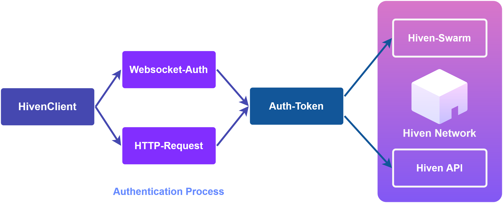

# Deploying your first Hiven-Bot

---

!!! Warning

    **This documentation page is not finished yet! Information can be outdated or entirely not available!**

Deploying a Bot is very easy and quick in OpenHiven.py while also very customisable.
With the ability to pass your own EventHandler and also customise handling and connection attributes you have
control on how exactly your Bot should run. Currently, due to the early Development Stage of some features
some might fail when using, if such a thing happens please report these on the Github Page.

!!! Tip

    For in-dept docs and information about customisation and functionality refer to the Reference pages, 
    where each object is explained and possible usage-examplesa are shown.

## Authentication and Tokens

As already shown in examples on the page [Intro to OpenHiven.py](./intro.html) to use a bot, you need to pass
a Token to authorise and connect to Hiven. This token is a key to the account that the Client will be
using to interact with the Hiven Platform. Therefore, OpenHiven.py cannot run without it, since its
features depend on such token. Because of that and the risk of other users taking over your account, it is
crucial to keep such a token save and not share it on any platform! Doing that could risk that your entire
account getting compromised! So try to keep it save!

{: width=900px align=center }

### Getting a User-token
* Step 1: Open your browsers development options.
* Step 2: Navigate in your Browser to your Web-Console which should allow code to be passed.
* Step 3: Execute this code-snippet `localStorage['hiven-auth']`. This will automatically fetch your token from the local Storage
* Step 4: Copy the returned hash-string. This string is the token itself which should have a length of 128 characters.
* **Recommended:** As already stated in [Authentication and Tokens](#authentication-and-tokens) store the token somewhere
  secure to avoid the risk of your account getting compromised!

### Getting a Bot-token

!!! info

    Currently creating a Bot is rather hard and requires a request directly to the Hiven Staff! Get in touch with the Hiven staff to request a Bot 
    or wait until Bot-Accounts have entered Stable State!

## Setting up a simple Bot

Setting up a simple Bot is relatively easy and quick. Choose the right Client-Type, pass a token, customise events and
let the bot run. Still, for each Client-Type there are multiple things to know before running:

=== "UserClient"

    A UserClient is a Client specifically made for User-Interaction using a User-Account on Hiven! That means it accesses
    the entire account and has full access to the Users data. 

    !!! Tip

        Try and create a Bot account if possible. This will avoid the risk of your account getting compromised in a
        security leak. To that BotClients are very neat and will have in the future a lot of optimisation and options
        targeted at long-time Bot Usage!

=== "BotClient"

    A BotClient is a Client targeted at Bots! That means it has special functionality directed
    to Bot-Usage and long time execution! That also means user interaction functionality is missing and classic
    relationships with Users are not supported!

### Creating a Bot-Account

### Setting up a simple EventListener
